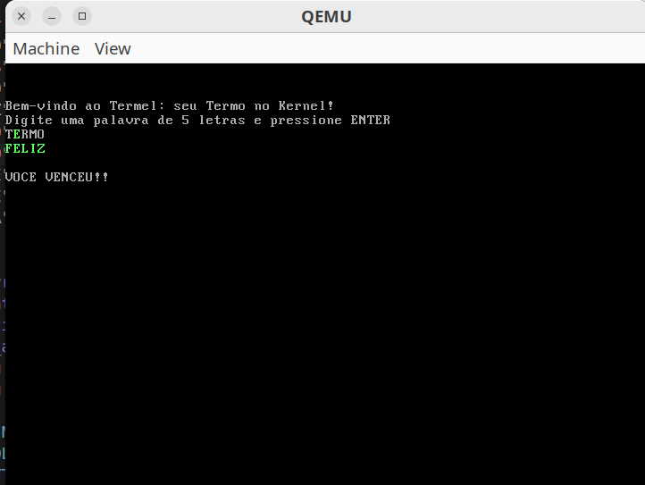

# Termel

O projeto consiste na criação de uma versão do jogo [Termo](https://term.ooo/) no kernel, com suporte a entrada via teclado e exibição de caracteres em tela, permitindo a execução de um jogo interativo direto no kernel.  



## Objetivo da Atividade
Implementar um **microkernel** contendo:
- Um **bootloader** em Assembly que chama uma função externa.
- Um **loop principal** implementado em C (ou outra linguagem, sendo C a mais recomendada).
- Capacidade de **exibir caracteres** na tela.
- Capacidade de **interagir com interrupções da CPU** para leitura do teclado.
- Desenvolvimento de um **jogo interativo simples** (como forca ou termo) rodando no kernel.

## Como Funciona
- O **bootloader** (em `bootloader.asm`) inicializa o sistema e chama a função principal do kernel.
- O **kernel** (em `kernel.c`) gerencia a exibição de texto e a interação com o teclado.
- O **mapeamento do teclado** é definido em `keyboard_map.h`.
- O **linker script** (`link.ld`) organiza a forma como os objetos serão carregados na memória.
- A execução é feita no **QEMU**, evitando a necessidade de hardware físico.

## Estrutura de Arquivos
- `bootloader.asm` → Bootloader em Assembly.  
- `kernel.c` → Código principal do kernel.  
- `keyboard_map.h` → Mapeamento de teclas.  
- `link.ld` → Script de linkedição.  
- `run.sh` → Script para compilar e rodar o kernel.  

## Como Executar

```bash
nasm -f elf32 bootloader.asm -o kasm.o
gcc -m32 -ffreestanding -c kernel.c -o kc.o
ld -m elf_i386 -T link.ld -o kernel.bin kasm.o kc.o
qemu-system-i386 -kernel kernel.bin
```

Ou simplesmente:

```bash
./run.sh
```

## Vídeo de Explicação

[Link para o vídeo aqui](https://drive.google.com/file/d/19kerqvkFy9pEeErYp01IwSVuB9tw2A6X/view?usp=drivesdk)
